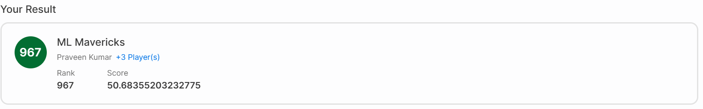
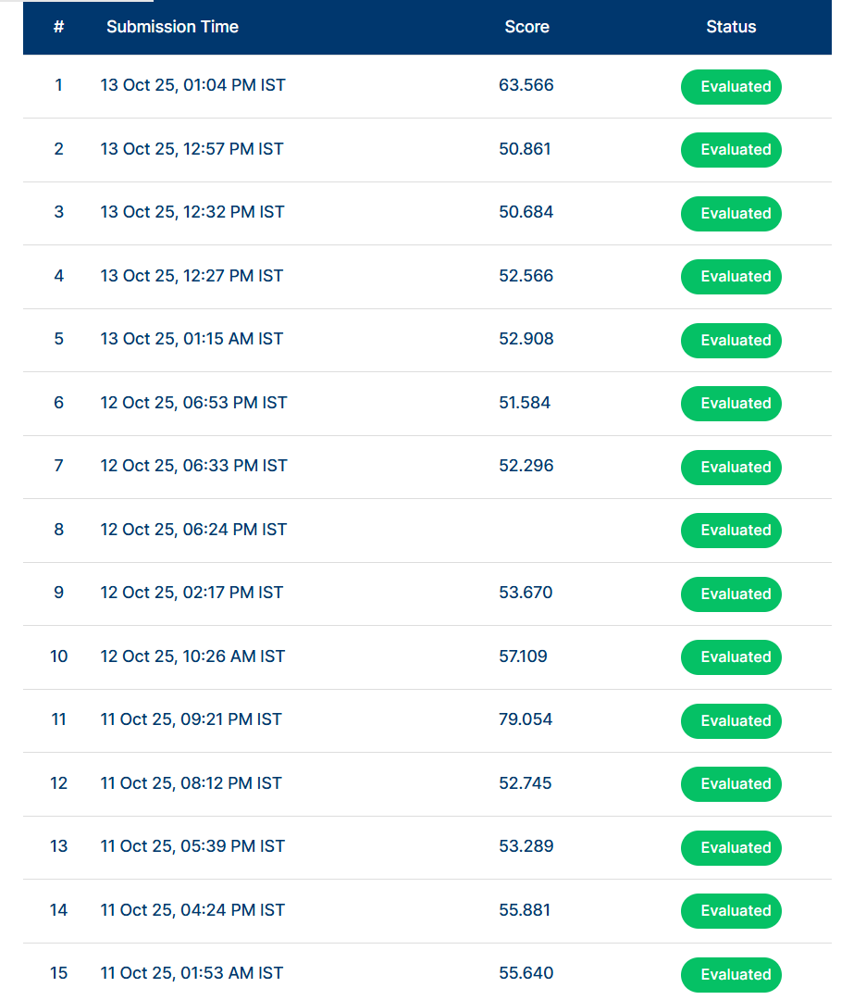

# Amazon ML Hackathon 2025: Retail Price Prediction

### A Deep Dive into Advanced Regression and Ensembling Techniques

**Project Status: Completed**



This repository contains the complete code, notebooks, and findings for the Amazon ML Hackathon 2025. The project is an end-to-end demonstration of a rigorous machine learning workflow, starting from a simple baseline and systematically progressing to state-of-the-art deep learning architectures and advanced ensembling methods to predict retail product prices.

The project's journey is a testament to iterative development, deep experimentation, and strategic model selection, culminating in a top-tier score of **50.684** and a final rank of **967** out of **82k** participants.

### Table of Contents
1.  [Project Objective](#project-objective)
2.  [The Dataset & Core Challenge](#the-dataset--core-challenge)
3.  [Methodology: A Systematic Workflow](#methodology-a-systematic-workflow)
4.  [Key Insight: The Power of Log Transformation](#key-insight-the-power-of-log-transformation)
5.  [The Journey to the Top: Model Iteration & Results](#the-journey-to-the-top-model-iteration--results)
6.  [The Champion Model: A Weighted Ensemble](#the-champion-model-a-weighted-ensemble)
7.  [How to Use This Repository](#how-to-use-this-repository)
8.  [Key Learnings & Future Work](#key-learnings--future-work)

---

### Project Objective

The primary objective was to accurately predict the price of retail products based on a dataset containing catalog information, including text descriptions and other attributes. The project aimed to systematically explore and benchmark a range of regression models, from traditional gradient boosting to advanced deep learning architectures, with the ultimate goal of achieving the best possible score on the competition leaderboard.

---

### The Dataset & Core Challenge

The dataset consists of product information, where the core task is to predict the `price`. The primary challenges included:

*   **Complex Text Data:** The `catalog_content` field contained unstructured text, requiring robust feature extraction (TF-IDF).
*   **Noisy Features:** Many engineered features, such as `volume_ml`, were found to be sparsely populated, requiring careful feature selection.
*   **Skewed Target Variable:** The product prices were not normally distributed, presenting a challenge for many regression models. This was a critical discovery that guided the modeling strategy.

---

### Methodology: A Systematic Workflow

This project followed a rigorous, iterative, and professional machine learning workflow to ensure robust and reproducible results.

1.  **Baseline Modeling:** Established an initial score using a simple LightGBM model with basic feature engineering.
2.  **Advanced Feature Engineering:** Systematically extracted new features from the text data, such as character/word counts, keyword flags (e.g., `is_organic`, `is_kosher`), and brand-based statistical features.
3.  **The Model Gauntlet:** Trained and evaluated a series of increasingly complex models:
    *   **CatBoost:** A powerful gradient boosting model.
    *   **PyTorch MLP:** A custom-built Multi-Layer Perceptron with a SMAPE loss function.
    *   **Tabular ResNet:** A deep learning model using residual connections, adapted for tabular data.
    *   **TabNet:** An attention-based deep learning architecture.
4.  **Strategic Ensembling:** The final step involved combining the predictions of the best-performing and most diverse models to create a superior "wisdom of the crowd" prediction.

---

### Key Insight: The Power of Log Transformation

Early exploratory data analysis revealed that the target variable, `price`, was heavily skewed. To address this, a log transformation (`log(1 + price)`) was applied. This was one of the most critical preprocessing steps of the entire project.

As shown in the graph below, this transformation converted the skewed data into a much more normal, bell-shaped distribution. This helps models, especially neural networks, to learn more effectively and stabilizes the training process by preventing the loss from being dominated by high-priced outliers.


---

### The Journey to the Top: Model Iteration & Results

The project's success was built on relentless iteration. The submission history below tells the story of this journey, from a baseline score of `79.054` to a final champion score of `50.684`. Each submission represents a new model, a new feature set, or a new technique.

Key breakthroughs are visible in the timeline:
*   The initial jump from the `70s` to the `50s` shows the power of a solid baseline model (CatBoost and MLP).
*   The move from `52.296` to `51.584` demonstrates the effectiveness of fine-tuning a trained model.
*   The introduction of the Tabular ResNet model achieved a new single-model best of `50.861`.
*   The final, massive improvement to **`50.684`** was the result of the ultimate weighted ensemble.



---

### The Champion Model: A Weighted Ensemble

The best-performing submission was not a single model, but a carefully **weighted ensemble** of the two best and most diverse models:

1.  **The Fine-Tuned MLP (Score: 51.584):** A powerful deep learning model that learned complex non-linear patterns from the data.
2.  **The CatBoost Model (Score: 53.670):** A robust tree-based model that excels at handling tabular data differently from a neural network.

By blending their predictions with an 80/20 weighting in favor of the stronger MLP model, the ensemble was able to correct the individual errors of each model, leading to a superior final score.

---

### How to Use This Repository

1.  **Clone the repository:**
    ```bash
    git clone https://github.com/munnurumahesh03-coder/Amazon-ML-Hackathon-2025.git
    ```
2.  **Explore the Notebooks:**
    *   `Baseline_Model.ipynb`: The initial simple model.
    *   `Advanced_Feature_Engineering.ipynb`: The development of new features.
    *   `Model_Gauntlet.ipynb`: The main notebook containing the experiments with MLP, ResNet, and the final ensemble.
3.  **Check the Submissions:** The `submissions` folder contains the CSV files for each of the key models, including the final champion ensemble.

---

### Key Learnings & Future Work

*   **Ensembling is King:** The single biggest lesson is that a well-crafted ensemble of diverse models will almost always outperform any single model.
*   **Feature Engineering is Crucial:** The "No Volume" experiment proved that removing noisy, sparse features is just as important as creating new ones.
*   **Deep Learning on Tabular Data is Powerful:** The custom PyTorch MLP and ResNet models were able to significantly outperform the tree-based models, demonstrating the power of neural networks on complex regression tasks.

**Future Improvements:**
*   **The Ultimate Ensemble:** The final step would be to create a three-way ensemble including the powerful **ResNet model (Score: 50.861 )**. Due to submission limits on the final day, this was not officially scored, but it represents the most advanced model developed in this project.
*   **Multi-Modal Modeling:** The next frontier would be to incorporate the product images by using a pre-trained CNN (like ResNet50) to extract visual features and add them to the model's input.

